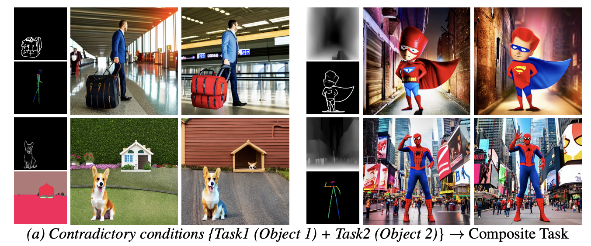
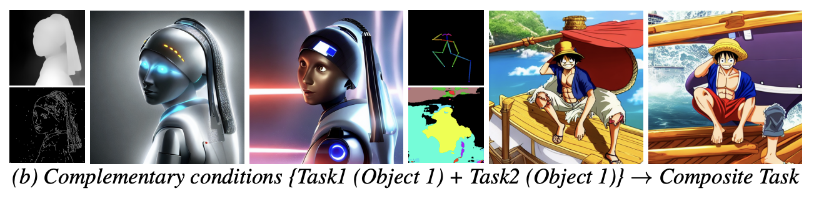

<h2 align="center"> <a href="">MaxFusion: Plug & Play multimodal generation in text to image diffusion models</a></h2>

<h5 align="center"> If you like our project, please give us a star ⭐ on GitHub for latest update.  </h2>


<h5 align="center">
    
[]()
[
[](https://arxiv.org/pdf/2404.09977) <br>


## Applications





Keywords: Multimodal Generation,   Text to image generation, Plug and Play


We propose **MaxFusion**, a plug and play framework for multimodal generation using text to image diffusion models.
    *(a) Multimodal generation*. We address the problem of conflicting spatial conditioning for text to iamge models .
    *(b) Saliency in variance maps*. We discover that the variance maps of different feature layers expresses the strength og conditioning.

<br>


### Contributions:

- We tackle the need for training with paired data for multi-task conditioning using diffusion models.
- We propose a novel variance-based feature merging strategy for diffusion models.
- Our method allows us to use combined information to influence the output, unlike individual models that are limited to a single condition.
- Unlike previous solutions, our approach is easily scalable and can be added on top of off-the-shelf models.

<!-- <p align="center">
  
</p> -->

## Environment setup 


```
conda env create -f environment.yml
```


## Code demo:

A notebook for differnt demo conditions is provided in demo.ipynb


# Testing On custom datasets 

Will be released shortly

##  Instructions for Interactive Demo

An intractive demo can be run locally using

```
python gradio_maxfusion.py

```


This code is reliant on:
```
https://github.com/google/prompt-to-prompt/
```

## Citation
5. If you use our work, please use the following citation

```
@article{nair2024maxfusion,
  title={MaxFusion: Plug\&Play Multi-Modal Generation in Text-to-Image Diffusion Models},
  author={Nair, Nithin Gopalakrishnan and Valanarasu, Jeya Maria Jose and Patel, Vishal M},
  journal={arXiv preprint arXiv:2404.09977},
  year={2024}
}
```
